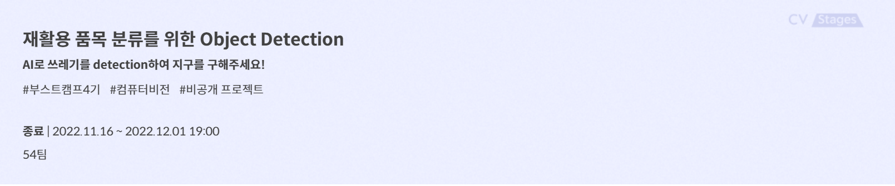
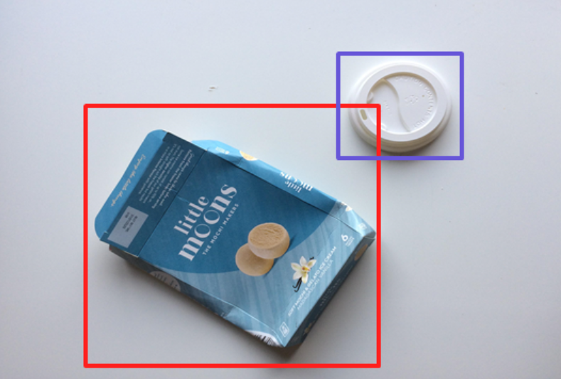
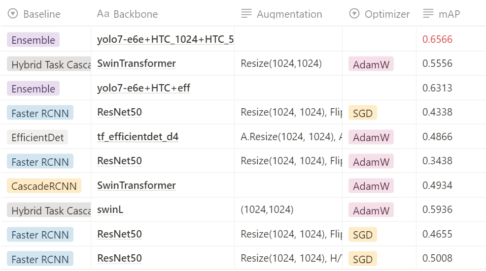
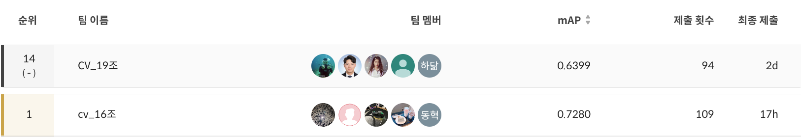

# 재활용 품목 분류를 위한 Object Detection

Naver BoostCamp AI Tech 4기 CV-19조 Object Detection 프로젝트

**🏅리더보드(public) 14위/19팀중**

**🏅리더보드(Private) 14위/19팀중**

## 1. 프로젝트 개요

### 📙 프로젝트 주제 

- 카메라로 촬영한 9754장의 이미지를 통해 **재활용품 위치**에 해당하는 좌표를 프로젝트

- 📆 **대회 기간** : 2022.11.16 ~ 2022.12.01 

- 🛠 **개발 환경**
  - 개발 환경 : VSCode, Jupyter Notebook, GPU(Tesla V100)
  - 협업 Tools : GitHub, Notion, Zoom

## 2.  팀원 소개 

<table>
  <tr>
    <td align="center"><a href="https://github.com/zergswim"> <b>박민규 </b></a> </td>
    <td align="center"><a href="https://github.com/RADM90"> <b>박제원 </b></a> </td>
    <td align="center"><a href="https://github.com/hdak95"> <b>백하닮 </b></a> </td>
    <td align="center"><a href="https://github.com/JunghoYoo"> <b>유정호 </b></a> </td>
    <td align="center"><a href="https://github.com/ths3847"> <b>서성관 </b></a> </td>
    </tr>
</table>

### 👨‍👨‍👦‍👦 팀원 역할

|  팀원  |                             역할                             |
| :----: | :----------------------------------------------------------: |
| 박민규 | EfficientDet, FasterRCNN, kfold, ensemble |
| 박제원 | Stratified K-Fold, Swin Transformer(Base), Dataset Modification |
| 백하닮 | Cascade R-CNN,  HTC(Hybrid Task Cascade) |
| 유정호 | EDA, YOLOv7 |
| 서성관 | SwinT, ATSS(Adaptive Training Sample Selection) |

## 3. Project 

### 📌 Process

1. Problem Definition

   > 10개의 CLASS로 구분된 재활용품 OBJECT에 대해 위치를 검출하는 모델 구현하고 mAP로 성능평가
   
   **Input :** 쓰레기 객체가 담긴 이미지와 bbox 정보(좌표, 카테고리) (COCO Format)
   **Output :** bbox 좌표, 카테고리, score 값 (Pascal VOC Format)

2. EDA를 통한 Data Cleaning

  - ***Annotation 면적***
    - 각 Annotation의 면적을 Pixel단위로 계산해서 분포를 확인하고 이상치 삭제
  - ***Annotation의 Width/Height 비율***
    - 각 Annotation의 Width/Height비율을 계산해서 분포를 확인하고 이상치 삭제
  - ***동일한 Image에 대한 Annotation 수***
    - 한 Image에 과도하게 Annotation된 Image에 대해 삭제
  - ***중복된 Image, Annotation 확인***
    - 중복된 Annotation (동일 Class이면서, Coordinate까지 정확히 동일한 경우)삭제
    

3. Data Processing

  - ***Stratified K-Fold***
    - K=5, sklearn의 StratifiedGroupKFold를 이용해서 데이터셋 분할 (shuffle True, random_state 1)
  - ***3:1 비율로 분할***
    - Battery class를 포함하는 image만 3:1비율로 랜덤하게 나눔. (가장 적은 수의 샘플을 가진 클래스)
    - 나머지 image도 3:1비율로 랜덤하게 나눔.

4. Modeling

  - YOLOv7
    - Public score : 0.6542/Private score : 0.6354 (K-Fold)
    - Public score : 0.5731/Private score : 0.5519 (No K-Fold)   
    - Augmentation : HSV-H/S/V, Mosaic, Flip Left/Right 
  - EfficientDet(tf_efficientdet_d4_ap) 
    - Public score : 0.5752/Private score : 0.5585 (No K-Fold)     
    - Augmentation : HorizontalFlip, VerticalFlip, RandomRotate90, CutOut, CutMix
  - Cascade R-CNN
    - Public score : 0.4322/Private score : 0.4239 (No K-Fold/ResNext-101)    
    - Public score : 0.4934/Private score : 0.4757 (No K-Fold/SwinT)   
    - Augmentation : RandomFlip, Normalize
  - Hybrid Task Cascade
    - Public score : 0.5057/Private score : 0.4906 (No K-Fold/SwinT-T-512)  
    - Public score : 0.5556/Private score : 0.5329 (No K-Fold/SwinT-T-1024)  
    - Public score : 0.5785/Private score : 0.5632 (No K-Fold/SwinT-L-512)  
    - Public score : 0.5936/Private score : 0.5753 (No K-Fold/SwinT-L-1024)  
    - Augmentation : RandomFlip, Normalize
  - ATSS
    - Public score : 0.6316/Private score : 0.6099 (ensemble with HTC_swinL+yolo7+effdet) 
    - Augmentation : RandomSizedBBoxSafeCrop, RandomBrightnessContrast, RandomFlip
    
5. Ensemble
  - WBF for YOLOv7 + EfficientDet + Hybrid Task Cascade(SwinT-L-512) + Hybrid Task Cascade(SwinT-L-1024) + Cascade R-CNN 
  

### 📈 Team Score Record

### 🏁 Result

- 🏅 Public Leaderboard

  

- 🏅 Private Leaderboard

  

